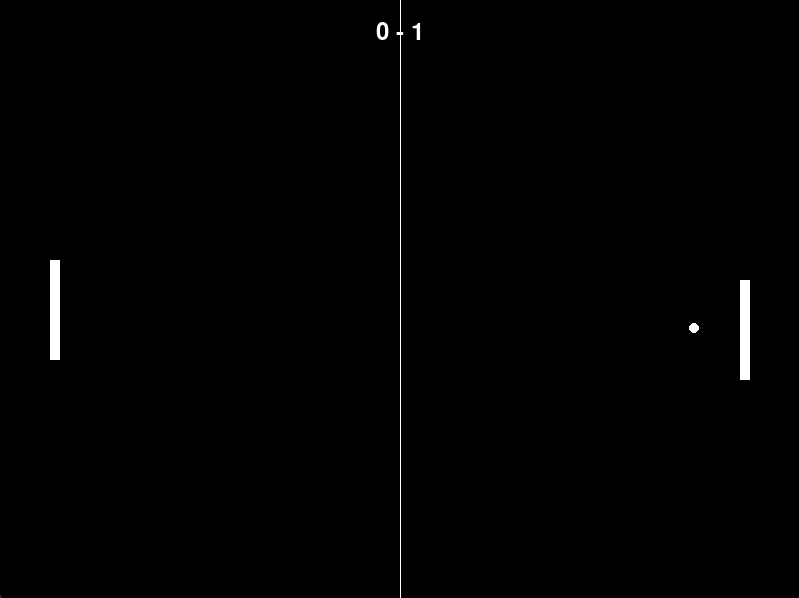
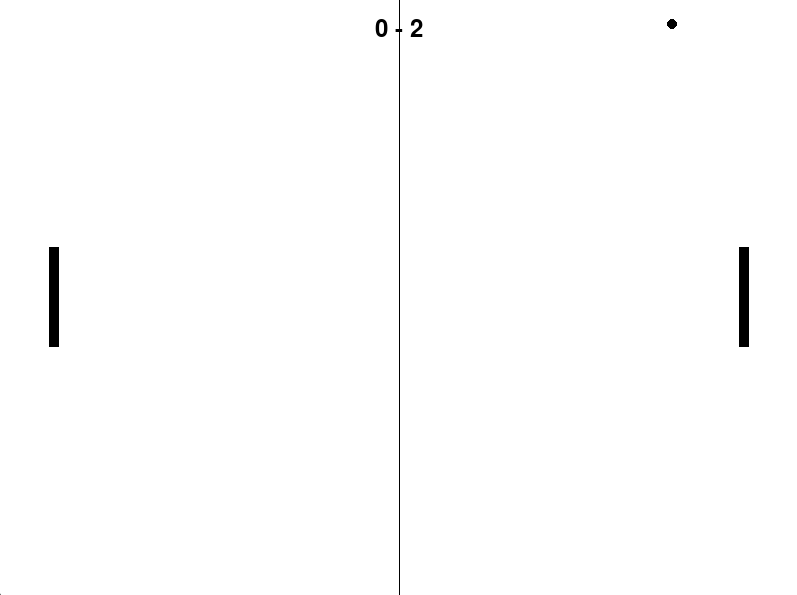

# 🦔 Sobre mim:
Olá! Me chamo Mathias Méndez, tenho 19 anos e sou estudante de Engenharia de Software. Atualmente também realizo cursos complementares pela EBAC, buscando evoluir constantemente na área de tecnologia e desenvolvimento.  Sempre tive grande interesse por computadores, jogos e programação, o que despertou minha curiosidade em entender como as tecnologias funcionam na prática. Me considero uma pessoa dedicada, persistente e sempre disposta a aprender coisas novas.  Meu objetivo é continuar desenvolvendo minhas habilidades, adquirir experiência e crescer profissionalmente através de projetos e novos desafios.

---

## 🌐 Redes Sociais:
  

---

# 💻 Tech Stack:
                                 

---

# 📊 GitHub Status:
 
 

---

# 🚀 Projetos em Destaque

---

# 🎮 Pong v3.0

  

  
  

Versão 3.0 do clássico Pong desenvolvida em Python, trazendo uma experiência moderna com versão web e desktop, sistema de personalização, configurações avançadas, recordes e melhorias visuais.

## ✨ Recursos

- 🎨 Sistema de personalização
- ⚙️ Menu de configurações
- 🖥️ Versão Desktop com Electron
- 🌐 Versão Web hospedada na Vercel
- 🏆 Sistema de recordes
- 🎵 Sons e efeitos
- 🎮 Gameplay clássica modernizada

## 📸 Preview

  
  

  
  

  

## 🔗 Links

🌐 Demo: https://pong-v3.vercel.app/  
📁 Repositório: https://github.com/ElMathidones/pong_v3

---

# 🕴️ Universo Wick

  
  

Landing page inspirada no universo John Wick, desenvolvida com foco em design moderno, ambientação cinematográfica e experiência visual imersiva.

## ✨ Recursos

- 🎬 Visual inspirado na franquia John Wick
- ✨ Interface moderna
- 📱 Layout responsivo
- ⚡ Navegação fluida
- 🎨 Efeitos visuais e animações

## 🔗 Links

🌐 Demo: https://universo-wick.vercel.app/  
📁 Repositório: https://github.com/ElMathidones/john_wick_site

---

# 🧮 Calculadora Vue

  

Calculadora web desenvolvida com Vue.js e Vite, focada em simplicidade, responsividade e performance.

## ✨ Recursos

- ⚡ Interface rápida e responsiva
- 🧮 Operações matemáticas básicas
- 🎨 Layout minimalista
- 📱 Compatível com dispositivos móveis

## 🔗 Links

🌐 Demo: https://calc-vue-app.vercel.app/  
📁 Repositório: https://github.com/ElMathidones/calculadora_vue

---

# 🎮 Pong v2

  

A segunda versão do Pong trouxe melhorias visuais, novas telas, sistema de configurações e modo retrô, expandindo a experiência do jogo original.

## ✨ Recursos

- 🎮 Gameplay aprimorada
- ⚙️ Menu de configurações
- 🕹️ Modo retrô
- 🖥️ Interface melhorada
- 🎨 Novos elementos visuais

## 📸 Preview

  
  

  
  

## 🔗 Links

📁 Repositório: https://github.com/ElMathidones/pong_v2

---

# 🎮 Pong v1

  
  

Primeira versão do clássico Pong desenvolvida em Python utilizando Pygame, marcando o início do projeto e da evolução das versões posteriores.

## ✨ Recursos

- 🎮 Gameplay clássica
- 🐍 Desenvolvido com Python + Pygame
- 🕹️ Multiplayer local
- 📦 Estrutura simples e funcional

## 🔗 Links

📁 Repositório: https://github.com/ElMathidones/pong_v1
